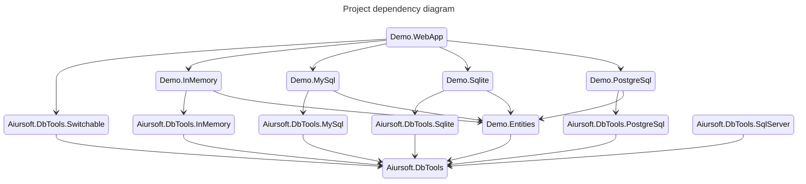

# DBTools

[](https://gitlab.aiursoft.com/aiursoft/DbTools/-/blob/master/LICENSE)
[](https://gitlab.aiursoft.com/aiursoft/DbTools/-/pipelines)
[](https://gitlab.aiursoft.com/aiursoft/DbTools/-/pipelines)
[](https://www.nuget.org/packages/Aiursoft.DbTools/)
[](https://manhours.aiursoft.com/r/gitlab.aiursoft.com/aiursoft/dbtools.html)

DbTools are Aiursoft's common database tools. It simplifies the process of registering DbContext and updating database. So your application can easily switch from different database types without editing the code.

## How to install

Run the following command to install `Aiursoft.DbTools.Switchable` to your ASP.NET Core project from [nuget.org](https://www.nuget.org/packages/Aiursoft.DbTools.Switchable/):

```bash
dotnet add package Aiursoft.DbTools.Switchable
```

Run the following command to install `Aiursoft.DbTools.InMemory` to your database implementation project from [nuget.org](https://www.nuget.org/packages/Aiursoft.DbTools.InMemory/):

```bash
dotnet add package Aiursoft.DbTools.InMemory
```

All database implementation projects must reference a single `AbstractDb` project. And you need to define and use the abstract class `YourDbContext` in it.

Make sure your project dependency is as follows:



## Usage

In your `startup.cs`:

```csharp
// In your Web project
public void ConfigureServices(IConfiguration configuration, IWebHostEnvironment environment, IServiceCollection services)
{
    var (connectionString, dbType, allowCache) = configuration.GetDbSettings();
    services.AddSwitchableRelationalDatabase(
        dbType: EntryExtends.IsInUnitTests() ? "InMemory": dbType,
        connectionString: connectionString,
        supportedDbs:
        [
            // These comes from your database implementation projects.
            new MySqlSupportedDb(allowCache: allowCache, splitQuery: false),
            new SqliteSupportedDb(allowCache: allowCache, splitQuery: true),
            new PostgreSqlSupportedDb(allowCache: allowCache, splitQuery: false),
            new InMemorySupportedDb()
        ]);

    services
        .AddControllersWithViews()
        .AddApplicationPart(typeof(Startup).Assembly);
}
```

In your `appsettings.json`:

```json
{
    "ConnectionStrings": {
        "AllowCache": "True",
        "DbType": "Sqlite",
        "DefaultConnection": "DataSource=app.db;Cache=Shared"
    }
}

```

Or:

```json
{
  // sudo docker run -d --name db -e MYSQL_RANDOM_ROOT_PASSWORD=true -e MYSQL_DATABASE=kahla -e MYSQL_USER=kahla -e MYSQL_PASSWORD=kahla_password -p 3306:3306 mysql
  "ConnectionStrings": {
    "AllowCache": "True",
    "DbType": "MySql",
    "DefaultConnection": "Server=localhost;Database=kahla;Uid=kahla;Pwd=kahla_password;"
  }
}
```
Or:


```json
{
  // sudo docker run --name kahla-postgres -e POSTGRES_DB=kahla -e POSTGRES_USER=kahla -e POSTGRES_PASSWORD=kahla_password -p 5432:5432 -d postgres:latest
  "ConnectionStrings": {
    "AllowCache": "True",
    "DbType": "PostgreSql",
    "DefaultConnection": "Server=localhost;Database=kahla;Uid=kahla;Pwd=kahla_password;"
  }
}
```

Or:

```json
{
  "ConnectionStrings": {
    "AllowCache": "False",
    "DbType": "InMemory"
  }
}
```

Simple, isn't it?

Your database project need to be different with your web project, you need the following command to generate migrations:

```bash
cd ./Demo.MySql
dotnet ef migrations add Init --context "MySqlContext" -s ../Demo.WebApp/Demo.WebApp.csproj
cd ..

cd ./Demo.Sqlite
dotnet ef migrations add Init --context "SqliteContext" -s ../Demo.WebApp/Demo.WebApp.csproj
cd ..

cd ./Demo.PostgreSql
dotnet ef migrations add Init --context "PostgreSqlContext" -s ../Demo.WebApp/Demo.WebApp.csproj
cd ..
```

For more usage, please check the `Demo` app in the `demos` folder!

## Custom Database Connection Configuration

You can configure the underlying database connection using the `onConnectionOpen` parameter. This is available for all relational databases (SQLite, MySQL, PostgreSQL, SQL Server).

For example, when using SQLite, you can register custom SQL functions:

```csharp
services.AddAiurSqliteWithCache<AppDbContext>(
    connectionString,
    allowCache: true,
    splitQuery: false,
    onConnectionOpen: (connection) =>
    {
        // Cast to the specific connection type if needed
        if (connection is Microsoft.Data.Sqlite.SqliteConnection sqliteConnection)
        {
             sqliteConnection.CreateFunction("MyCustomFunction", (int x) => x * 2);
        }
    });
```

This callback is invoked every time a database connection is opened.

## How to contribute

There are many ways to contribute to the project: logging bugs, submitting pull requests, reporting issues, and creating suggestions.

Even if you with push rights on the repository, you should create a personal fork and create feature branches there when you need them. This keeps the main repository clean and your workflow cruft out of sight.

We're also interested in your feedback on the future of this project. You can submit a suggestion or feature request through the issue tracker. To make this process more effective, we're asking that these include more information to help define them more clearly.
