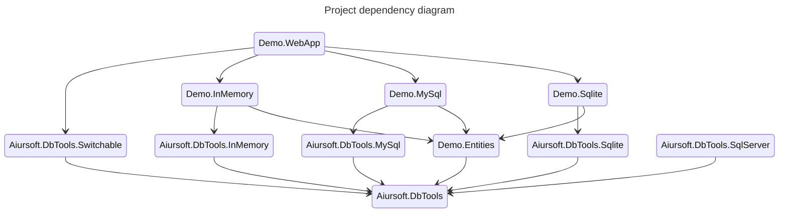

# DBTools

[](https://gitlab.aiursoft.cn/aiursoft/DbTools/-/blob/master/LICENSE)
[](https://gitlab.aiursoft.cn/aiursoft/DbTools/-/pipelines)
[](https://gitlab.aiursoft.cn/aiursoft/DbTools/-/pipelines)
[](https://www.nuget.org/packages/Aiursoft.DbTools/)
[](https://gitlab.aiursoft.cn/aiursoft/dbtools/-/commits/master?ref_type=heads)

DbTools are Aiursoft's common database tools. It simplifies the process of registering DbContext and updating database. So your application can easily switch from different database types.

## Installation

To install `Aiursoft.DbTools` to your project from [nuget.org](https://www.nuget.org/packages/Aiursoft.DbTools/):

```bash
dotnet add package Aiursoft.DbTools
```

## Project structure



## Usage

In your `startup.cs`:

```csharp
public void ConfigureServices(IConfiguration configuration, IWebHostEnvironment environment, IServiceCollection services)
{
    var (connectionString, dbType, allowCache) = configuration.GetDbSettings();
    services.AddSwitchableRelationalDatabase(
        dbType: EntryExtends.IsInUnitTests() ? "InMemory": dbType,
        connectionString: connectionString,
        supportedDbs:
        [
            new MySqlSupportedDb(allowCache: allowCache, splitQuery: false),
            new SqliteSupportedDb(allowCache: allowCache, splitQuery: true),
            new InMemorySupportedDb()
        ]);

    services
        .AddControllersWithViews()
        .AddApplicationPart(typeof(Startup).Assembly);
}
```

In your `appsettings.json`:

```json
{
    "ConnectionStrings": {
        "AllowCache": "True",
        "DbType": "Sqlite",
        "DefaultConnection": "DataSource=app.db;Cache=Shared"
    }
}

```

Or:

```json
{
  // sudo docker run -d --name db -e MYSQL_RANDOM_ROOT_PASSWORD=true -e MYSQL_DATABASE=kahla -e MYSQL_USER=kahla -e MYSQL_PASSWORD=kahla_password -p 3306:3306 hub.aiursoft.cn/mysql
  "ConnectionStrings": {
    "AllowCache": "True",
    "DbType": "MySql",
    "DefaultConnection": "Server=localhost;Database=kahla;Uid=kahla;Pwd=kahla_password;"
  }
}
```

Or:

```json
{
  "ConnectionStrings": {
    "AllowCache": "False",
    "DbType": "InMemory"
  }
}
```

Simple, isn't it?

Your database project need to be different with your web project, you need the following command to generate migrations:

```bash
cd ./Demo.MySql
dotnet ef migrations add Init --context "MySqlContext" -s ../Demo.WebApp/Demo.WebApp.csproj
cd ..

cd ./Demo.Sqlite
dotnet ef migrations add Init --context "SqliteContext" -s ../Demo.WebApp/Demo.WebApp.csproj
cd ..
```

For more usage, please check the `Demo` app in the `demos` folder!

## How to contribute

There are many ways to contribute to the project: logging bugs, submitting pull requests, reporting issues, and creating suggestions.

Even if you with push rights on the repository, you should create a personal fork and create feature branches there when you need them. This keeps the main repository clean and your workflow cruft out of sight.

We're also interested in your feedback on the future of this project. You can submit a suggestion or feature request through the issue tracker. To make this process more effective, we're asking that these include more information to help define them more clearly.
